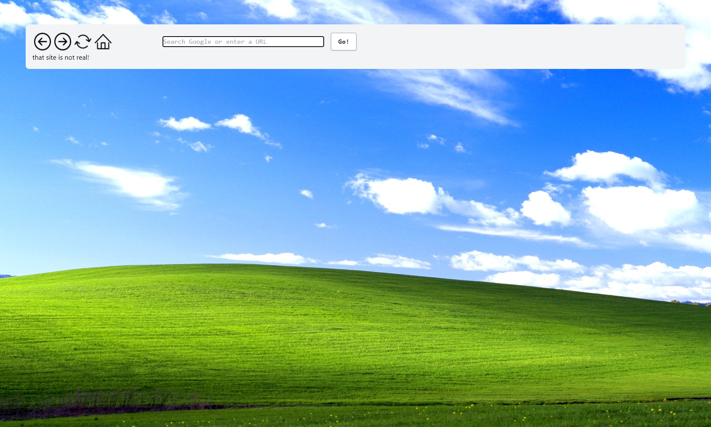
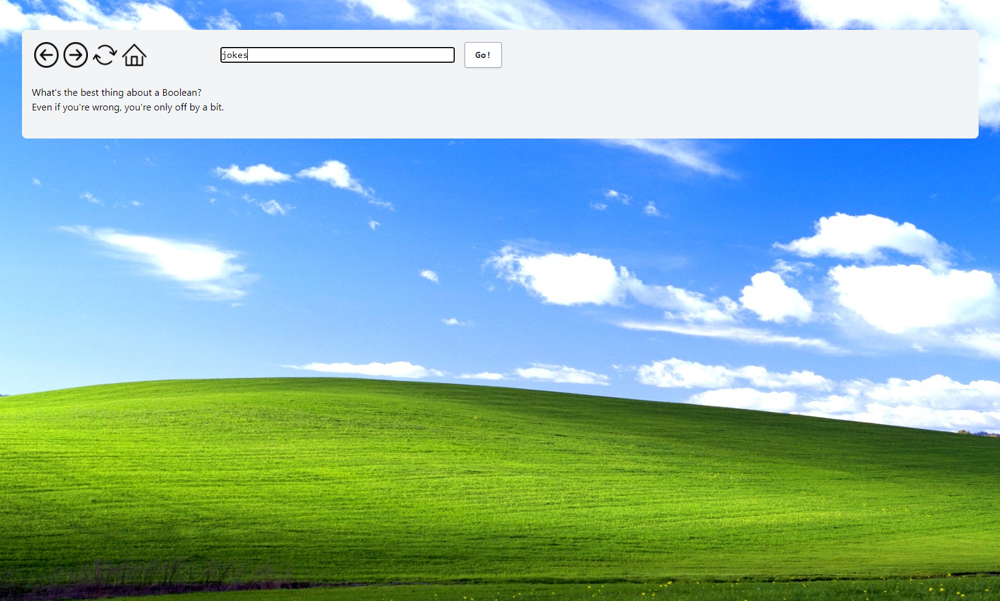
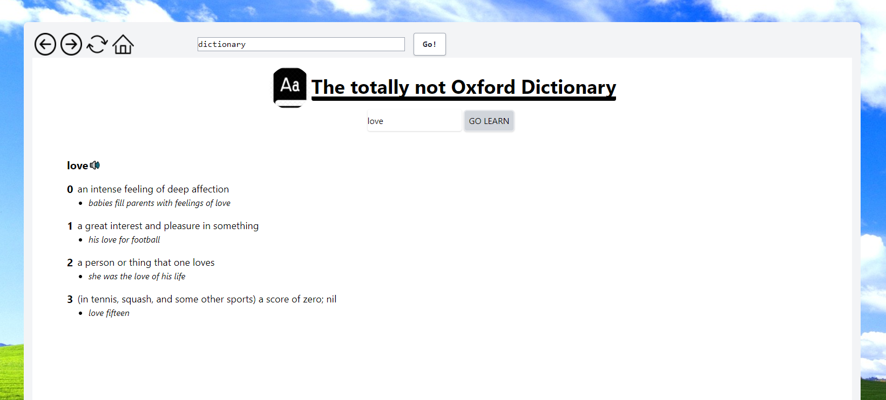
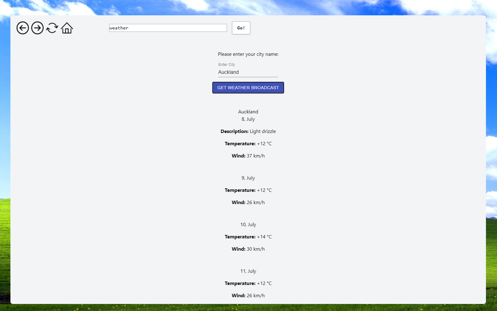
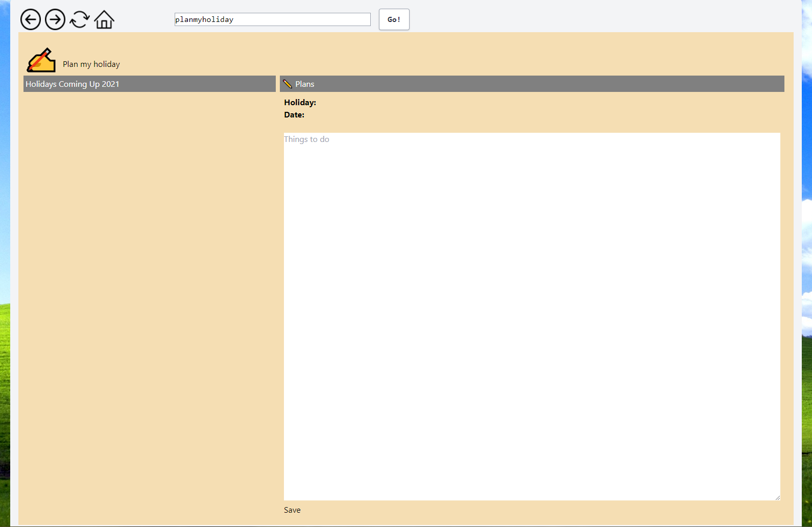

# CHROMIUM

As a team we decided to create a website that has the looks of Chromium browser and consumes 4 diffrent external APIs.

### From the command line

```bash
npm install # to install dependencies
npm run knex migrate:latest # to reset database
npm run knex seed:run # to get seed data
npm run dev # to start the dev server
```

You can find the server running on [http://localhost:3000](http://localhost:3000).

## User Stories
1. As a user I want to be able to read a programming joke. 
    - To view the Programming Jokes API type **jokes** in the search box.
2. As a user I want to be able to see the waether forcast by city.
    - To view the Weather API type **weather** in the search box.
3. As a user I want to be able to seach for the definition of English words with pronounciation.
    - To view the Dictionary API type **dictionary** in the search box.
4. As a user I want to be able to use a holiday planner to plan and make notes for my upcoming holidays.
    - To view the Holiday Planner API type **planmyholiday** in the search box.


## User interface

Home Page|
------------------------------------|
|

Programming Jokes API Page|Dictionary API Page
------------------------------------|------------------------------
|

Weather API Page|Holiday Planner API Page
------------------------------------|-------------------------------
|

## Details

## Tech Stack
**Client:** React, Redux, TailwindCSS

**Server:** NodeJS, ExpressJS, KnexJS

## Authors
- Yuan - [@seegg](https://github.com/seegg) - Dictionary API.

- Sina Kakhki - [@sina-kakhki](https://github.com/sina-kakhki) - Programming Jokes API.

- Dmitriy Yegorov - [@Dyegor](https://github.com/Dyegor) - Weather API.

- Kateti Mareko - [@ispeakcode01](https://github.com/ispeakcode01) - Holiday Planner API.

- Johnny Sainsbury - [@johnny-sainsbury](https://github.com/johnny-sainsbury) - Home page and all of the stylings.
